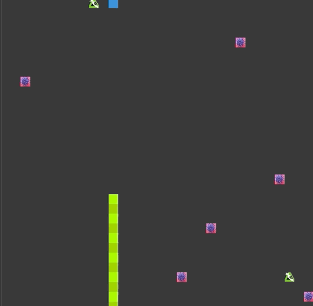

# CPPND: Capstone Snake Game Example

This is a starter repo for the Capstone project in the [Udacity C++ Nanodegree Program](https://www.udacity.com/course/c-plus-plus-nanodegree--nd213). The code for this repo was inspired by [this](https://codereview.stackexchange.com/questions/212296/snake-game-in-c-with-sdl) excellent StackOverflow post and set of responses.

The necessary rubric my submission satisfies (Besides the mandatory):

1.  The project demonstrates an understanding of C++ functions and control structures.
2.  The project reads data from a file and process the data, or the program writes data to a file.
3.  The project accepts user input and processes the input.
4.  The project uses Object Oriented Programming techniques.
5.  Classes use appropriate access specifiers for class members.
6.  Class constructors utilize member initialization lists.
7.  Classes abstract implementation details from their interfaces.
8.  Classes encapsulate behavior.
9.  Classes follow an appropriate inheritance hierarchy.
10. Overloaded functions allow the same function to operate on different parameters.
11. Derived class functions override virtual base class functions.
12. Templates generalize functions in the project.

## Dependencies for Running Locally
* cmake >= 3.7
  * All OSes: [click here for installation instructions](https://cmake.org/install/)
* make >= 4.1 (Linux, Mac), 3.81 (Windows)
  * Linux: make is installed by default on most Linux distros
  * Mac: [install Xcode command line tools to get make](https://developer.apple.com/xcode/features/)
  * Windows: [Click here for installation instructions](http://gnuwin32.sourceforge.net/packages/make.htm)
* SDL2 >= 2.0
  * All installation instructions can be found [here](https://wiki.libsdl.org/Installation)
  * Note that for Linux, an `apt` or `apt-get` installation is preferred to building from source.
* gcc/g++ >= 5.4
  * Linux: gcc / g++ is installed by default on most Linux distros
  * Mac: same deal as make - [install Xcode command line tools](https://developer.apple.com/xcode/features/)
  * Windows: recommend using [MinGW](http://www.mingw.org/)

## Basic Build Instructions

1. Clone this repo.
2. Make a build directory in the top level directory: `mkdir build && cd build`
3. Compile: `cmake .. && make`
4. Run it: `./SnakeGame`.
